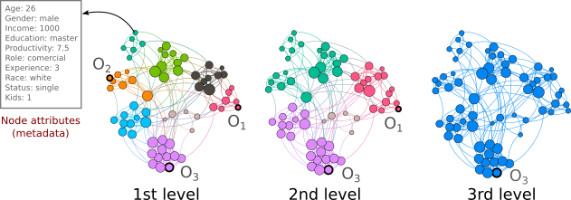
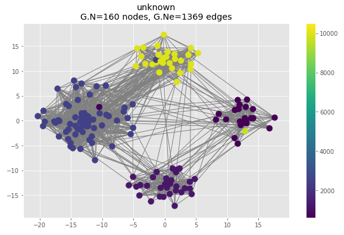
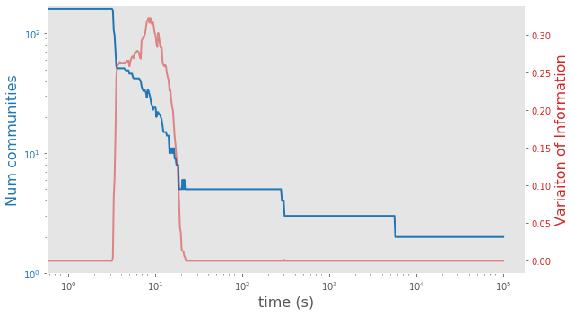
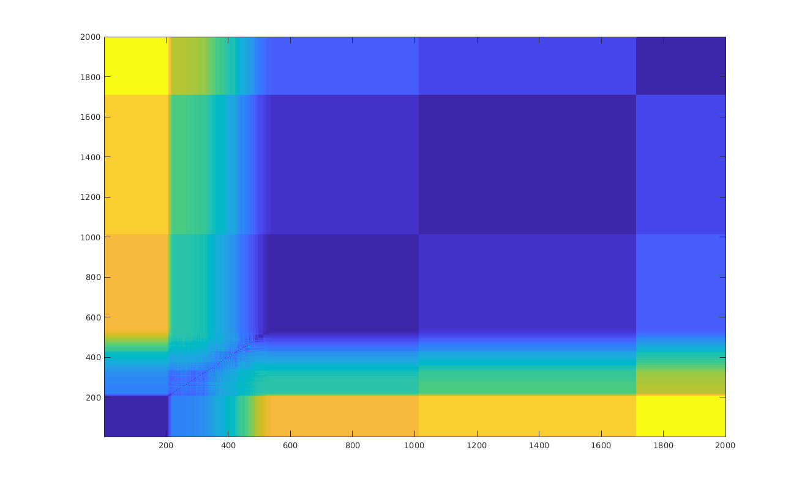
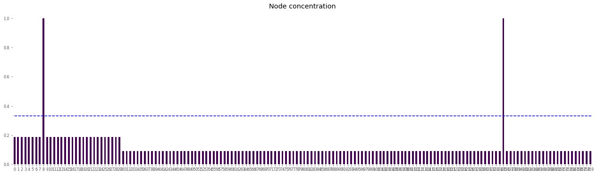
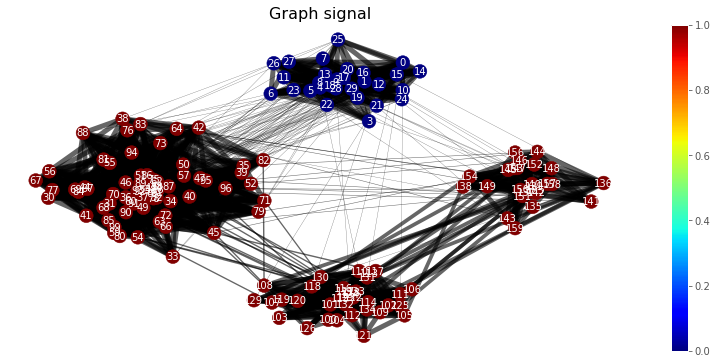

# MADAN
> Leonardo Gutiérrez-Gómez, Alexandre Bovet and Jean-Charles Delvenne<br>

MADAN is the acronym of **Multi-scale Anomaly Detection on Attributed Networks**.
This is an unsupervised algorithm to uncover anomalous nodes on attributed networks, i.e., graphs with node attributes, and the context of node anomalies, i.e., the clusters where they are abnormal.
MADAN can be used to detect anomalous nodes with respect to the node attributes and network structure at *all scales* of the network.

<p align="center">

</p>

<font size="+1">Figure 1. A toy example of work relation network. Nodes have  attributes  describing  individual  features.  Node  at-tributes define structural clusters in multiple scales. At the 1st scale outlier nodes (O1,O2,O3) lie within a local con-text, i.e, offices. In a 2nd scale, departments emerge as new contexts where O2 is not defined. Finally, at a larger scale O3 remains as a global anomaly in context of the whole company.</font>


Here you can find the MADAN scripts with some examples and results implemented on our paper:\
**_Multi-scale Anomaly Detection For Attributed Networks (MADAN algorithm), published at AAAI-20 conference.
[Preprint.](https://arxiv.org/abs/1912.04144)_**

--------------------------------------------------------------------------------------------------------------------
## Requirements
Tested on Jupyter notebook 5.7.0 with Python 3.7.3, networkx 2.5, sklearn 0.21.2, pygsp 0.5.1

**Note:** For efficiency reasons some functions were written in cython. We recommend you to compile them before, running the following script:
```
python setup.py build_ext --inplace 
```

## Example: Income network
Suppose you have a social network where we know the income of each person. 

<p align="center">

</p>

We aim to find anomalous people, i.e., persons with an unexpected income according to the network structure.

#### Initiating MADAN ####
```
import Madan as md
madan = md.Madan(net, attributes=['income'], sigma=0.08)
```
Where net is a networkx graph with node attributes. If sigma is not given then it is computed as in the paper.

#### Scanning relevant scales ####
Before to look at anomalies, we should scan the relevant context (scales) where potential anomalies may lie.

```
time_scales   =   np.concatenate([np.array([0]), 10**np.linspace(0,5,500)])
madan.scanning_relevant_context(time_scales, n_jobs=4)
```

<p align="center">

</p>

We can also scan relevant contexts for different times, i.e., VI(t,t'):

```
madan.scanning_relevant_context_time(time_scales)
```
<p align="center">

</p>

#### Uncovering anomalous nodes and context ####
The previous analysis suggests three relevant contexts for anomalies. We look at anomalous nodes at a given scale by computing the concentration for all nodes, at for instance t=1000:
```
madan.compute_concentration(1000)
madan.concentration
```
<p align="center">

</p>

and the anomalous nodes:
```
madan.anomalous_nodes
[8, 135]
```
The context for anomalies at the given concentration scale t:
```
madan.compute_context_for_anomalies()
madan.interp_com

{0: 0, 1: 0, 2: 0, 3: 0, 4: 0, 5: 0, 6: 0, 7: 0, 8: 0, 9: 0, 10: 0, 11: 0, ...,
1, 150: 1, 151: 1, 152: 1, 153: 1, 154: 1, 155: 1, 156: 1, 157: 1, 158: 1, 159: 1}


madan.plot_graph_context(coord=corrd)
```

<p align="center">

</p>

node #135 is anomalous in the red context (a high income person among medium and low income people), whereas node #8 is anomalous only in the blue cluster (a medium income person within the rich people cluster) at the given scale.

## Jupyter notebooks ##

* Running MADAN algorithn on a toy example network. (Figure 2 of the paper).

```
toy_example.ipynb
```

* MADAN algorithn on a real life dataset, the Disney copurchasing network (Figure 5 of the paper)

```
Case_of_study_Disney.ipynb
```

#### Benchmarking on synthetic networks ######

* MADAN algorith on synthetic networks
We generate artificial attributed networks with ground truth anomalies and evaluate the performance of recovering anomalous nodes varing the percentage of anmalies in the network (Figure 3 of the paper).

The following script will compute the ROC/AUC and PR/AUC metrics for the synthetic networks:

```
python LFR_MADAN.py
```

* Then plotting the scores as the Figure 3 of the paper:

```
cd plot_LFR/
python plot_scores.py
```

#### Real life examples ######

* Running anomaly detection on the Disney copurchasing network data and computes ROC-AUC score, (Table 2 of the paper).
```
python run_real_data.py
```
    
### Citing
If you find *MADAN* useful for your research, please consider citing the following paper (Bibtex):

	@inproceedings{madan-aaai20,
	author = {Gutiérrez-Gómez Leonardo, Bovet Alexandre and Delvenne Jean-Charles},
	 title = {Multi-scale Anomaly Detection on Attributed Networks},
	 booktitle = {Proceedings of the 34th AAAI Conference on Artificial Intelligence (AAAI-20)},
	 year = {2020}
	}

### Miscellaneous

Please send any questions you might have about the code and/or the algorithm to <leonardo.gutierrez@list.lu>.
